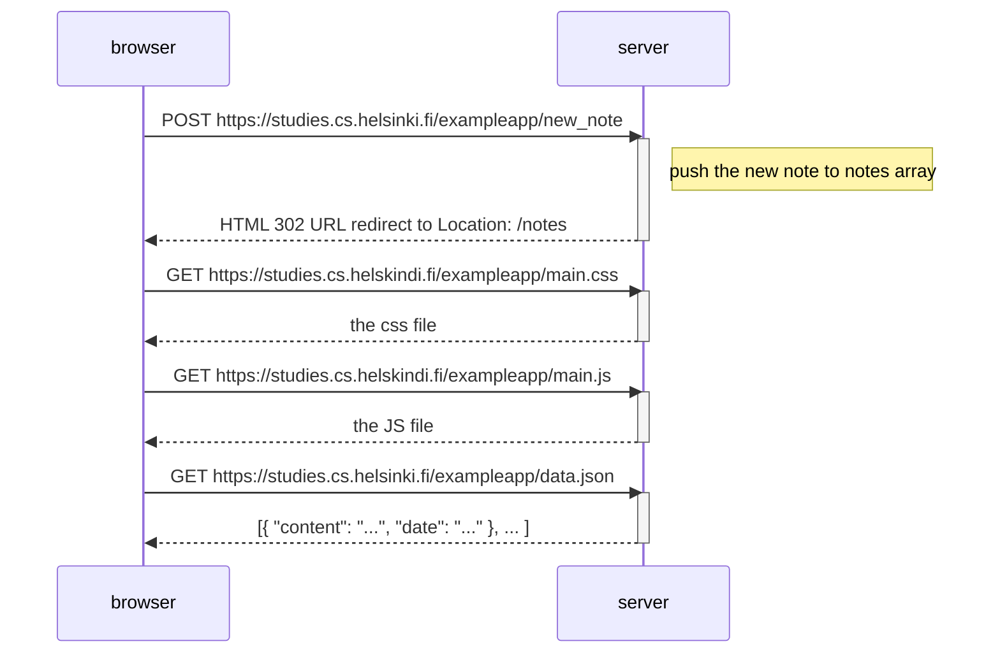

```mermaid
sequenceDiagram
    participant browser
    participant server

    browser->>server: POST https://studies.cs.helsinki.fi/exampleapp/new_note
    activate server
    Note right of server: push the new note to notes array
    server-->>browser: HTML 302 URL redirect to Location: /notes
    deactivate server

    browser->>server: GET https://studies.cs.helskindi.fi/exampleapp/main.css
    activate server
    server-->>browser: the css file
    deactivate server

    browser->>server: GET https://studies.cs.helskindi.fi/exampleapp/main.js
    activate server
    server-->>browser: the JS file
    deactivate server

    browser->>server: GET https://studies.cs.helsinki.fi/exampleapp/data.json
    activate server
    server-->>browser: [{ "content": "...", "date": "..." }, ... ]
    deactivate server
```