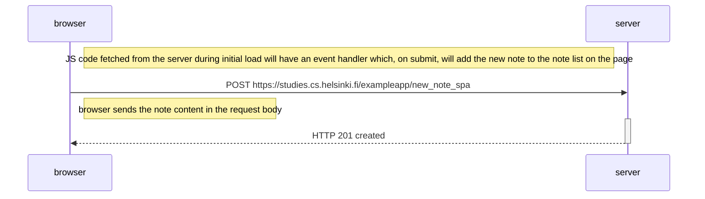

```mermaid
sequenceDiagram
    participant browser
    participant server

    Note right of browser: JS code fetched from the server during initial load will have an event handler which, on submit, will add the new note to the note list on the page
    browser->>server: POST https://studies.cs.helsinki.fi/exampleapp/new_note_spa
    Note right of browser: browser sends the note content in the request body
    activate server
    server-->>browser: HTTP 201 created
    deactivate server
```